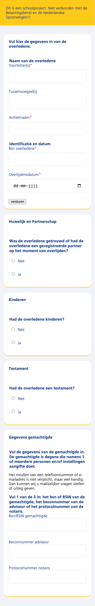
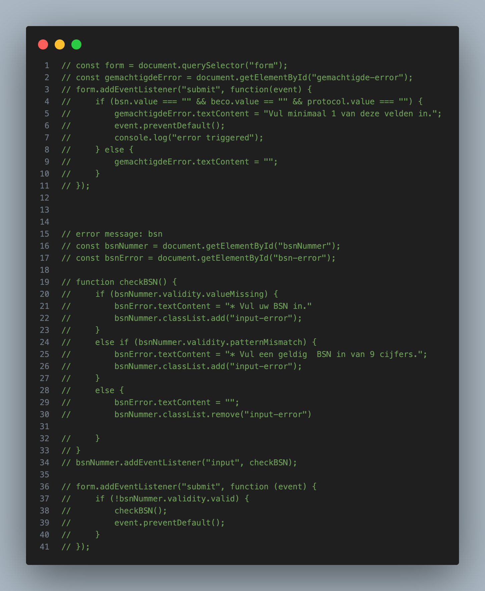
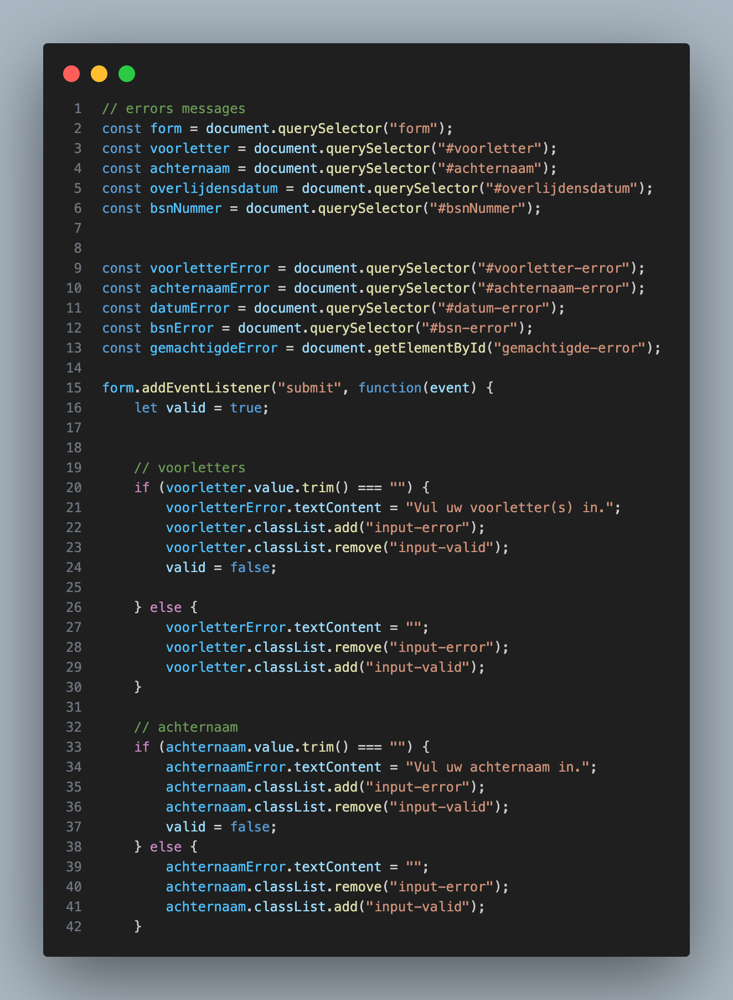

## 16 februari (maandag)
Vandaag hadden we een workshop over HTML-inputs en formulier-validatie. Ik werkte samen met Jelle, maar ik heb vandaag vooral aan de HTML-structuur gewerkt.

Ik leerde dat input:invalid ervoor zorgt dat velden al vanaf het openen van de pagina als “fout” kunnen worden gestyled.
Dat is slechte UX, omdat required-velden meteen invalid zijn, nog vóórdat de gebruiker iets heeft gedaan. Dit botst met het idee van validatie op het juiste moment (niet te vroeg).

Mijn aanpak vandaag

Omdat er veel tegelijk te zien was, heb ik ervoor gekozen om per onderdeel te werken:

Ik heb veel stukken tijdelijk in comment gezet.

Daarna werkte ik stap voor stap, zodat ik overzicht hield en mijn HTML netjes en duidelijk bleef.

## 17 februari
Wat ik heb uitgewerkt

Vandaag heb ik het eerste deel (naam/gegevens en nummers) beter georganiseerd en extra validatie toegevoegd.

1) BSN: precies 9 cijfers

Ik probeerde af te dwingen dat er exact 9 cijfers ingevuld kunnen worden:

<label for="bsn">Bsn overledene</label>
<input
  type="text"
  name="bsn"
  id="bsn"
  inputmode="numeric"
  pattern="^[0-9]{9}$"
  minlength="9"
  maxlength="9"
  required
/>

Hier heb ik gewerkt met pattern, minlength en maxlength om de invoer te beperken tot exact negen cijfers.

2) Overlijdensdatum: niet in de toekomst

Ik stelde een maximumdatum in zodat de datum niet in de toekomst kan liggen:

<label for="overlijdensdatum">Overlijdensdatum</label>
<input type="date" name="overijdensdatum" id="overlijdensdatum" max="2026-02-17" required />

Ik ontdekte ook dat een datum alleen correct werkt in het formaat YYYY-MM-DD (dus niet 17-02-2026).

3) Autocomplete

Ik leerde dat autocomplete niet via CSS gaat, maar als HTML-attribuut wordt toegevoegd (bijvoorbeeld autocomplete="name").
Dat was nieuw voor mij, omdat ik eerst dacht dat dit via styling werd geregeld.

Ik merk dat ik langzaam werk, maar daardoor wordt mijn HTML wel netter en overzichtelijker.
Wat ik nog lastig vind is vooral de styling van formulieren — dat kost mij op dit moment het meeste moeite.
Plan:
-Verder met de styling van het formulier
-Extra uitleg/video’s zoeken over form styling, omdat ik de uitleg op MDN nog niet voldoende vond
#Scool opdracht- Belastingformulieren

## Feedback voortgangsgesprek – 20 februari

Tijdens het eerste gesprek hebben we kort naar mijn formulier gekeken.  
Over het algemeen zag het er goed uit, maar er waren nog een paar kleine verbeterpunten.

Zo merkte Vasilis op dat mijn eerste **fieldset** nog geen **legend** heeft.  
Elke fieldset hoort een legend te hebben, dus ik kan bijvoorbeeld mijn **h1 aanpassen en die als legend gebruiken**.

Daarnaast zijn er een paar kleine dingen die ik nog kan verbeteren in de styling:
- het tekstveld kan ik leeg (wit) maken, meer zoals bij de formulieren van **NS**
- aan de randen van de secties kan ik een **gele highlight of shadow** toevoegen, zodat het meer lijkt op de NS-stijl

## 2 maart (maandag)

Vandaag heb ik vooral gewerkt aan de **HTML-structuur van het formulier**.

Ik ontdekte dat mijn HTML eerder niet helemaal goed opgebouwd was. In het begin stond bijna alles binnen **één fieldset**. Daarom heb ik de structuur opnieuw opgebouwd en de onderdelen beter gescheiden.

Ik heb geprobeerd elke groep vragen in een **aparte fieldset** te plaatsen. Dit hielp mij om het formulier beter te begrijpen en maakte de code ook overzichtelijker.

Daarnaast heb ik geprobeerd elke vraag of sectie **duidelijk van elkaar te scheiden**. Vanuit UX-perspectief voelde dit logischer, omdat het anders leek alsof alle labels gewoon onder elkaar stonden zonder duidelijke structuur. Dat maakte het formulier minder overzichtelijk en niet echt logisch voor de gebruiker.

Voor morgen wil ik verder werken aan:

- **Validatie van de velden**
- Het toepassen van één van de **interaction patterns** waar Vasilis over sprak

Bijvoorbeeld het **uitklappen/verbergen van vragen**. Als de gebruiker bijvoorbeeld **“Nee”** kiest, hoeven de extra opties die bij **“Ja”** horen niet zichtbaar te blijven.

## 3 maart

Vandaag had ik niet zo veel om te laten zien, maar ik heb de hele dag gewerkt aan het verbergen van vragen die niet nodig zijn wanneer de gebruiker "Nee" kiest.

Ik probeerde een oplossing te maken voor het in- en uitklappen van vragen (progressive disclosure).

Mijn eerste idee was om twee classes op dezelfde div te gebruiken: één class voor de styling in CSS en een andere class die ik met JavaScript kon gebruiken om elementen te verbergen. Maar dit vond ik een beetje ingewikkeld en niet zo overzichtelijk.

Daarom hield ik het simpeler. Ik gebruikte uiteindelijk één class en het `hidden` attribuut om onderdelen te verbergen.

Later op de dag kreeg ik het werkend en kon ik de vragen verbergen wanneer de gebruiker **"Nee"** kiest. Zo ziet de gebruiker alleen de vragen die echt nodig zijn.

Over het algemeen vond ik dit een goede oefening, omdat het uiteindelijk werkte.

Ik heb hier bewust gekozen voor de interaction pattern progressive disclosure.

De reden hiervoor is dat sommige aanvullende vragen niet altijd relevant zijn. Als de gebruiker bijvoorbeeld „Nee“ kiest, zou het verwarrend en overbodig zijn om door te gaan met het tonen van aanvullende vragen die alleen van toepassing zijn op „Ja“.

Door deze vragen standaard te verbergen, blijft het formulier overzichtelijker en minder rommelig. Daardoor ziet de gebruiker alleen de informatie die op dat moment relevant is. Vanuit het oogpunt van de gebruikerservaring vond ik dit logischer dan alles in één keer weer te geven.

Technisch gezien heb ik dit probleem opgelost door een bepaald gedeelte zichtbaar of verborgen te maken op basis van de geselecteerde optie. 
Volgende week wil ik verder werken aan:
- validatie van de inputvelden  
- mogelijk beginnen met het tweede interaction pattern, als ik daar genoeg tijd voor heb

## Feedback voortgangsgesprek – 6 maart

Tijdens het voortgangsgesprek zei Vasilis dat mijn formulier er netjes en duidelijk uitziet.

Ik heb al een paar patron toegepast en ik wil nog een extra patroon toevoegen.

Ik moet nog beginnen met de validatie van het formulier.  
Vasilis gaf aan dat het soms handig kan zijn om javascript te gebruiken om de validatie-meldingen beter te stylen.

Hij gaf ook een belangrijk voorbeeld met de opties **ja / nee**.  
Als een veld alleen required is wanneer iemand **ja** kiest, moet het formulier wel gewoon verzonden kunnen worden wanneer iemand **nee** kiest. Dat moet ik dus goed controleren bij de validatie.

### Volgende stappen
Voor volgende week ga ik:
- beginnen met de validatie
- nog een tweede patroon toevoegen

## 9 maart

Vandaag heb ik vooral gewerkt aan de **validatie van het formulier**.

Ik heb eerst de lezing van de gastspreker gevolgd. Daarna hadden we een workshop over form-validatie en probeerde ik dit meteen in mijn eigen code toe te passen. Tijdens de workshop heb ik ook een check-out gedaan met Dylan.

Ik begon de dag met het toevoegen van visuele feedback aan de inputvelden. Wanneer een veld correct wordt ingevuld verandert de randkleur. Ik heb ook een verzendknop toegevoegd om te testen wat er gebeurt wanneer het formulier wordt verzonden terwijl niet alle velden zijn ingevuld. In dat geval worden de velden rood gemarkeerd.

Daarbij probeerde ik het verschil te begrijpen tussen `:valid`, `:invalid` en `:user-valid` / `:user-invalid`.

Wanneer ik deze selectors gebruikte:

input:focus{
    border-color: rgb(0, 48, 130);
}

input:invalid{
    box-shadow: 0 0 0 .25em rgb(214, 54, 38, 0.35);
}

input:valid{
    box-shadow: 0 0 0 .25em rgb(46, 125, 50, .35);
}

## 10 maart

Vandaag ben ik begonnen met het toevoegen van een tweede patroon in het formulier.  
Daarvoor heb ik gekeken naar de mogelijkheden op de tweede pagina van de aangifte(Gegevens van de gemachtigde).

Ik ben dit gaan oplossen met **JavaScript**. De duidelijkste aanpak voor mij was het gebruik van een **if–else structuur**.  
Het idee is dat wanneer één van de velden wordt ingevuld, de twee andere velden automatisch **disabled** worden. Op die manier kan de gebruiker maar één optie kiezen.

Daarnaast heb ik vandaag ook geprobeerd te begrijpen **waarom de legend boven het veld uitstak**.  
Mijn idee was om de eerste fieldset eigenlijk meer als een **container** te gebruiken, en de inhoud daarvan in een tweede fieldset te plaatsen.

Samen met **Vasilis** heb ik uiteindelijk gewerkt aan het **stylen van de legend**, zodat deze beter aansluit op het ontwerp.  
Het resultaat was visueel een stuk beter en duidelijker.

.groep > legend{
    display: block;
    background: white;
    border-radius: 1em 1em 0 0;
    padding: 1.25em;
    margin: 0 0 0 -1.24em;
    width: calc(100% + 2.5em);
}

In dit gedeelte heb ik voor een tweede patroon  gekozen: Vul 1 van de 3 in.     

In dit gedeelte wordt de gebruiker gevraagd een van de drie velden in te vullen. Als alle drie de velden tegelijkertijd actief blijven, kan dit verwarring veroorzaken over wat er precies moet worden ingevuld.

Daarom heb ik ervoor gekozen om de andere twee velden automatisch **uit te schakelen** zodra de gebruiker in een van de velden begint te typen. Dit maakt de keuze duidelijker en voorkomt dat de gebruiker per ongeluk meerdere opties invoert.

Ik vond dit een logische oplossing, omdat het niet alleen het formulier duidelijker maakt, maar de gebruiker ook naar de juiste invoer leidt.

## Feedback voortgangsgesprek – 13 maart

De vergadering verliep goed; het was de laatste vergadering voor de oplevering.

Ik heb mijn werk van deze week toegelicht en heb me vooral gericht op de validatie:

*Groen als het veld correct is
*Rood als het fout is

Ik heb dit in HTML geïmplementeerd (bijvoorbeeld: het moet uit 9 cijfers bestaan),
en ik heb ook geprobeerd om op twee manieren foutmeldingen toe te voegen:

via HTML en via JavaScript

Feedback:
-Let op de witruimte en contouren
-Verbeter de UX
-Schakel autocomplete uit
-Er is inconsistentie tussen de vragen en antwoorden

Probleem:
De foutmelding verschijnt nog niet, ik moet het required-attribuut aanpassen.

## 16 maart Maandag

14. De `novalidate`-attribuut is voor het formulier gebruikt.

Hierdoor is de standaard gegevensvalidatie in de browser uitgeschakeld.

Dit was nodig omdat dit formulier gebruikmaakt van aangepaste validatie via JavaScript.

Bijvoorbeeld in de regel „Vul één van de drie velden in”.

De browser kan dit soort logica niet automatisch controleren.

Daarom wordt de gegevensvalidatie uitgevoerd met JavaScript en worden aangepaste foutmeldingen weergegeven. 
Bron: https://developer.mozilla.org/en-US/docs/Web/HTML/Reference/Elements/form#novalidate

2. In het begin had elke foutmelding een aparte JavaScript-functie.

Dit leidde tot een onduidelijke validatiestructuur en sommige foutmeldingen werkten niet altijd correct.

Daarom is de validatie later samengevoegd in één centrale verzendfunctie.

Bij het verzenden van het formulier worden nu alle velden tegelijkertijd gecontroleerd.

Dit maakt de code overzichtelijker en zorgt ervoor dat alle foutmeldingen consistent worden weergegeven. Na de verbetering:

## 17 maart Dinsdag
17 maart:

1. CSS-verbeteringen
Tijdens de ontwikkeling van het formulier heb ik enkele kleine aanpassingen aan de CSS doorgevoerd om het ontwerp overzichtelijker en consistenter te maken.

Ik heb bijvoorbeeld het volgende gedaan:

* De afstand tussen de kaartknop, de vragen en de invoervelden aangepast om het formulier overzichtelijker en beter leesbaar te maken.
* Het ontwerp van de selectieknoppen en de focusstanden verbeterd.
* Het ontwerp van de velden en labels consistenter gemaakt.
* De foutmeldingen visueel duidelijker gemaakt door een rood kader toe te voegen rond de onjuiste velden.

Deze aanpassingen zorgen ervoor dat het formulier overzichtelijker en gebruiksvriendelijker is.

2. Helpteksten
Op sommige plaatsen in het formulier heb ik korte helpteksten toegevoegd om de vragen voor de gebruiker te verduidelijken. Deze teksten zijn gemaakt met behulp van de HTML-elementen details en summary, zodat de uitleg standaard verborgen blijft en alleen verschijnt wanneer erop wordt geklikt.

Bijvoorbeeld bij de vragen: “Wat betekent ‘overleden’?” en “Wat is een testament?”.

Bron: https://developer.mozilla.org/en-US/docs/Web/HTML/Element/details

## Reflectie

**Eindresultaat**

In dit project heb ik een formulier ontwikkeld met de nadruk op gegevensvalidatie, structuur en gebruiksvriendelijkheid. Het formulier bevat verschillende soorten invoervelden met gegevensvalidatie via HTML (zoals verplichte velden, velden met een patroon en invoerpatronen). Daarnaast heb ik visuele feedback toegevoegd met behulp van CSS, waarbij de stijl van de velden verandert op basis van of de invoer correct is of niet. Ook heb ik extra validaties toegevoegd met behulp van JavaScript om foutmeldingen weer te geven en het validatieproces voor de gebruiker te verduidelijken. Het eindresultaat is een formulier dat niet alleen efficiënt werkt, maar ook gemakkelijk te begrijpen is.

**Wat goed ging**

Het opzetten van de basis van het formulier verliep soepel. Het valideren van gegevens met HTML leverde meteen een effectieve structuur op zonder dat er veel extra code geschreven hoefde te worden. Ook het toevoegen van visuele feedback met CSS was een succes en maakte het verschil tussen een juiste en een foutieve invoer duidelijk. Beetje bij beetje werd het formulier overzichtelijker en gestructureerder.

**Wat moeilijk was**

Het moeilijkste deel was het integreren van de gegevensvalidatie met HTML en JavaScript. Het gelijktijdig valideren van meerdere velden en het correct weergeven van foutmeldingen zorgde voor enkele problemen. Ik merkte ook dat een kleine fout in de logica (zoals het onjuist gebruiken van geneste voorwaardelijke constructies) er al snel voor zorgde dat de gegevensvalidatie niet meer correct werkte.

**Waar ik trots op ben**

Ik ben er trots op dat het prototype nu duidelijke feedback geeft en niet alleen afhankelijk is van de standaardmeldingen van de browser. De gebruiker krijgt zowel visuele als tekstuele feedback, wat de gebruikerservaring verbetert. Ik ben ook tevreden over mijn aanpak: eerst HTML en CSS gebruiken en daarna pas JavaScript toevoegen. Dit is de eerste keer dat ik met Formler werk en ik vind het echt een krachtige ervaring.

**Mislukte pogingen**

Ik heb verschillende manieren geprobeerd om foutmeldingen toe te voegen, zowel via HTML-attributen als via JavaScript. Sommige oplossingen waren niet compatibel of gaven geen duidelijke feedback. Ook gebruikte ik aanvankelijk een minder efficiënte structuur in JavaScript, die ik later heb aangepast.

** Nieuwe inzichten (HTML/CSS/JS)**

Ik heb geleerd dat HTML-validatie een solide basis vormt en dat je er veel mee kunt bereiken zonder JavaScript. CSS speelt een belangrijke rol bij het visueel weergeven van feedback. JavaScript is vooral nodig voor meer controle en flexibiliteit, maar moet op een logische en gestructureerde manier worden toegepast. 

**Wat ik verder wil verkennen**

Ik wil mijn vaardigheden verbeteren in het organiseren van gegevensvalidatie in JavaScript zonder herhaling, en in het consistent maken van foutmeldingen. Daarnaast wil ik meer oefenen met het verbeteren van de gebruikerservaring in formulieren.